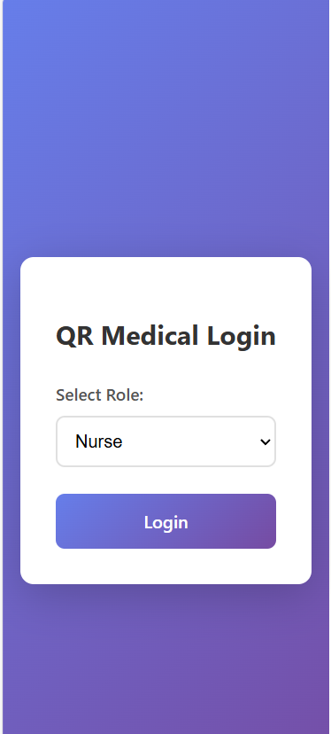
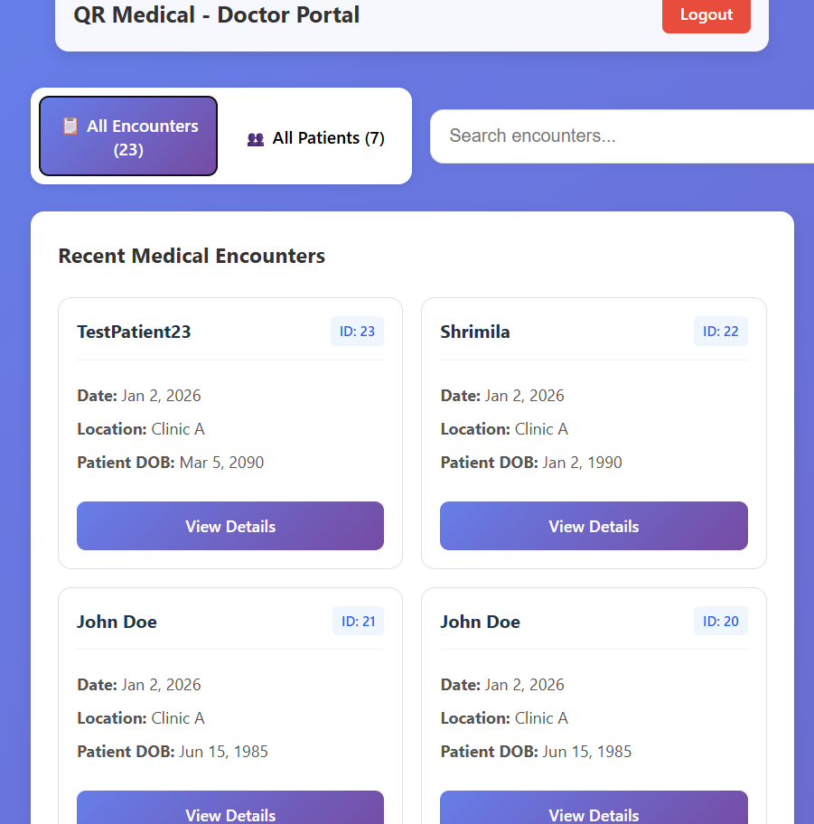
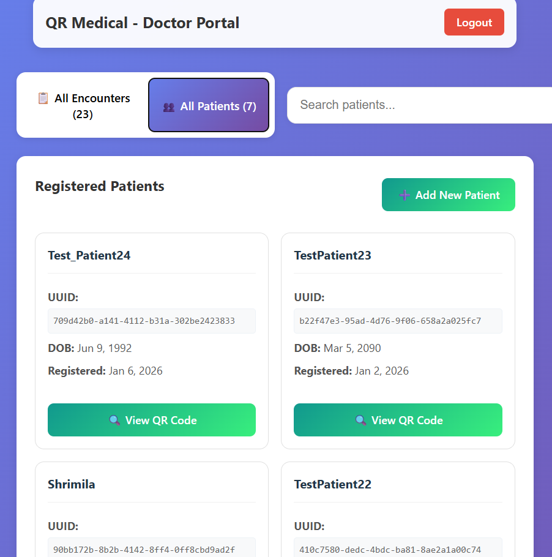
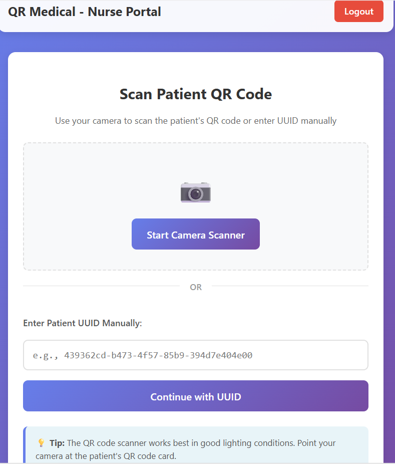
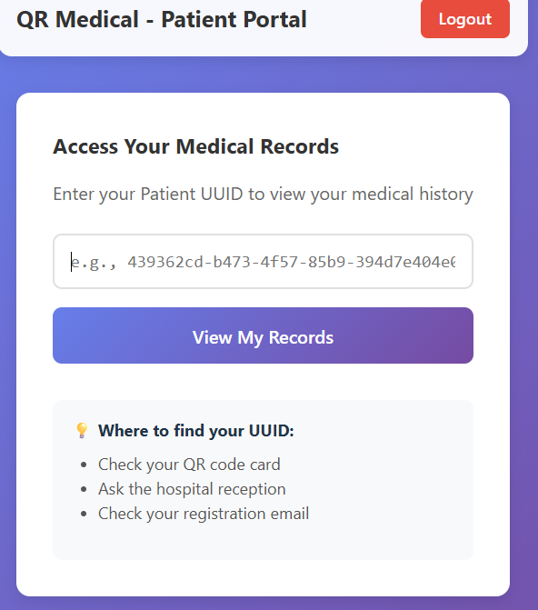

## Project Overview

**MediQR** is a full-stack healthcare application designed to **digitize, secure, and simplify access to patient medical records** using QR codes.
It enables **doctors, nurses, and patients** to interact with medical data through dedicated portals while maintaining privacy and ease of use.

The system supports **QR-based patient identification**, **image uploads**, **OCR-powered data extraction**, and **graph detection from medical reports**, making it ideal for modern clinical workflows.

---

## Key Features

### Doctor Portal

* Register new patients
* Auto-generate **unique patient QR codes**
* View and manage patient lists
* Search patients instantly
* View & download patient QR codes
* View uploaded medical images and extracted data

### Nurse Portal

* Scan patient QR codes using **device camera**
* Manual UUID entry fallback
* Upload handwritten prescriptions / reports
* Secure, fast patient identification

### Patient Portal

* Access personal medical records
* View & download own QR code
* See encounter history
* Secure patient switching

---

## Advanced Capabilities

*  **Camera-based QR scanning**
*  **Medical image preview**
*  **OCR extraction from handwritten notes**
*  **Graph detection & extraction from reports**
*  **Fast patient search**
*  **Restricted access to sensitive records**
*  **Fully responsive UI (mobile & desktop)**

---
## User Workflows

### Doctor

```
Login → Patients → Add Patient → Generate QR → Download / Print
```

### Nurse

```
Login → Scan QR → Identify Patient → Upload Prescription
```

### Patient

```
Login → View Records → View / Download QR
```

---

## Tech Stack

### Frontend

* React.js
* Axios
* Modern CSS (Gradients, Animations)
* QR Scanner Integration

### Backend

* Node.js
* Express.js
* REST APIs
* Authentication & Authorization

### Database

* PostgresSQL (UUID-based patient records)

### AI / Processing

* Python OCR for handwritten text extraction
* Image analysis for graph detection

---

## Security Highlights

* UUID-based patient identification
* Role-based access control (Doctor / Nurse / Patient)
* Restricted access to medical reports
* Optional biometric hash support 


## Screenshots
### Login Portal


### Doctor Portal


### Add Patient Modal


### Nurse QR Scanner


### Patient Portal



---


## Acknowledgements

Inspired by real-world hospital workflows and modern digital healthcare systems.

---

## Running the Project Locally

Follow the steps below **in order** to run the application successfully.

---

### 🔹 Prerequisites

Make sure you have the following installed:

* **Node.js** (v18 or later recommended)
* **npm**
* **Python 3.8+**
* **PostgreSQL** (configured and running)

---

### Step 1: Clone the Repository

```bash
git clone https://github.com/Dhiya-Natarajan/MedQR.git
cd MedQR
```

---

### Step 2: Install Dependencies

#### Backend (Root Project)

```bash
npm install
```

#### Frontend

```bash
cd front-end
npm install
```

---

### Step 3: Start the Python OCR Server (IMPORTANT)

Before starting the frontend and backend, you must run the **Python OCR server**. This is for converting images to raw text

```bash
cd Python
python OCR_server.py
```

Keep this terminal **running**.

---

### Step 4: Start the Backend Server

Open a **new terminal**, go to the **root project directory**, and run:

```bash
npm run dev
```

---

### Step 5: Start the Frontend Server

Open **another terminal**, navigate to the frontend folder, and run:

```bash
cd front-end
npm run dev
```

---

### Step 6: Access the Application

* **Frontend:** [http://localhost:5173](http://localhost:5173)
* **Backend API:** [http://localhost:3000](http://localhost:3000)
* **Python OCR Server:** running locally (as started in Step 3)

---

### Important Notes

* The **Python OCR server must be running** before uploading medical images.
* Keep **all three servers running simultaneously**:

  * Python OCR server
  * Node.js backend
  * React frontend
* Stop servers using **Ctrl + C** in their respective terminals.

---


